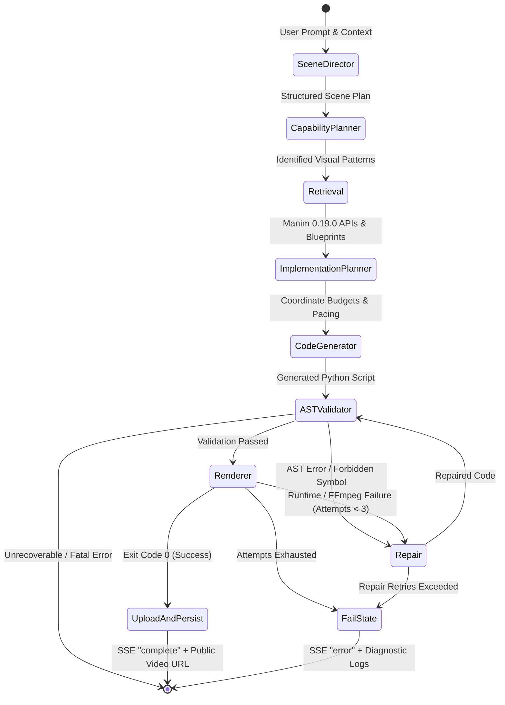

# Cursor 2D Animation Studio 🎬⚡

> **Autonomous, Multi-Agent Manim Engine for Programmatic 2D Mathematical & Scientific Animations**  
> Powered by LangGraph, NVIDIA Nemotron, ChromaDB RAG, AST Static Verification, and Supabase.

[](https://www.python.org/downloads/)
[](https://fastapi.tiangolo.com)
[](https://langchain-ai.github.io/langgraph/)
[](https://www.manim.community/)
[](https://nextjs.org/)
[](https://supabase.com/)
[](LICENSE)

---

## Table of Contents

- [Overview](#overview)
- [Key Features](#key-features)
- [System Architecture](#system-architecture)
  - [High-Level Architecture](#high-level-architecture)
  - [LangGraph Agentic State Machine](#langgraph-agentic-state-machine)
  - [End-to-End Request Lifecycle](#end-to-end-request-lifecycle)
- [Tech Stack](#tech-stack)
- [Database & Storage Architecture](#database--storage-architecture)
  - [PostgreSQL Schema & ERD](#postgresql-schema--erd)
  - [Row Level Security (RLS)](#row-level-security-rls)
  - [Storage Pipeline](#storage-pipeline)
- [LangGraph Pipeline Deep Dive](#langgraph-pipeline-deep-dive)
  - [1. Scene Director](#1-scene-director)
  - [2. Capability Planner](#2-capability-planner)
  - [3. Knowledge Retrieval (RAG)](#3-knowledge-retrieval-rag)
  - [4. Implementation Planner](#4-implementation-planner)
  - [5. Code Generator](#5-code-generator)
  - [6. AST Validator & Security Sandbox](#6-ast-validator--security-sandbox)
  - [7. Sandboxed Renderer](#7-sandboxed-renderer)
  - [8. Self-Healing Repair Loop](#8-self-healing-repair-loop)
- [API Reference](#api-reference)
  - [Authentication Endpoints](#authentication-endpoints)
  - [Project & Chat Endpoints](#project--chat-endpoints)
  - [SSE Streaming Endpoint Contract](#sse-streaming-endpoint-contract)
- [Prerequisites](#prerequisites)
- [Getting Started](#getting-started)
  - [1. Clone Repository](#1-clone-repository)
  - [2. Backend Setup](#2-backend-setup)
  - [3. Database Migration](#3-database-migration)
  - [4. Knowledge Base Ingestion](#4-knowledge-base-ingestion)
  - [5. Frontend Setup](#5-frontend-setup)
- [Environment Variables](#environment-variables)
  - [Backend Configuration (`backend/.env`)](#backend-configuration-backendenv)
  - [Frontend Configuration (`frontend/.env`)](#frontend-configuration-frontendenv)
- [Testing & Quality Assurance](#testing--quality-assurance)
- [Production Deployment & Containerization](#production-deployment--containerization)
- [Security Guardrails](#security-guardrails)
- [Troubleshooting](#troubleshooting)

---

## Overview

**Cursor 2D Animation** is an enterprise-grade, agentic generation studio that converts natural language explanations into mathematically precise, broadcast-quality 2D vector animations using [Manim Community Edition (0.19.0)](https://www.manim.community/).

Traditional LLM code generation fails when producing Manim scripts due to hallucinated APIs, broken coordinate geometries, bounding box collisions, and unhandled runtime exceptions. Cursor 2D Animation eliminates these failure modes using an **autonomous multi-agent feedback loop built on LangGraph**:

1. **Deconstructs** prompts into structured cinematic scenes and visual patterns.
2. **Grounds** code generation via hybrid ChromaDB vector search + Manim 0.19.0 API relationship graphs.
3. **Validates** syntax and safety before execution via Python AST static analysis (blocking arbitrary execution, dangerous imports, and invalid class hierarchies).
4. **Renders** headless MP4 videos with execution timeouts in isolated processes.
5. **Auto-Repairs** broken renders using targeted error extraction and recursive feedback loops (up to 3 automated recovery cycles).
6. **Streams** real-time progress to a full-height Next.js 16 reactive canvas via Server-Sent Events (SSE).

---

## Key Features

- 🧠 **Autonomous Multi-Agent LangGraph Engine**: Multi-stage state graph separating direction, spatial planning, grounding, generation, validation, execution, and self-repair.
- 📐 **Rigorous Coordinate & Layout Planning**: Dedicated spatial budget nodes allocate screen coordinates, boundary margins, and camera viewports before code synthesis.
- 📚 **Grounded RAG Knowledge Base**: Local ChromaDB index and relationship graph indexing 100+ verified Manim 0.19.0 classes, methods, parameters, and official reference examples.
- 🛡️ **Python AST Security Sandbox**: Static code analysis that inspects abstract syntax trees to enforce `Scene` class inheritance, verify `construct()` entrypoints, and ban dangerous syscalls (`eval`, `exec`, `__import__`, `subprocess`, `os.system`).
- 🔄 **Autonomous Self-Healing Loop**: If rendering or validation fails, the compiler extracts symbol errors, retrieves matching API signatures, and passes targeted diffs to the repair node without user intervention.
- 📡 **Real-Time Server-Sent Events (SSE)**: Granular step-by-step progress emitted from backend graph to frontend (Director → Planning → Retrieval → Synthesis → Validation → Render → S3/Supabase Upload).
- 🗄️ **Multi-Tenant Supabase Architecture**: User authentication via Supabase JWT, projects & chat threads with PostgreSQL Row Level Security (RLS), and video asset storage in Supabase Storage.
- 🎨 **Obsidian Dark Studio Interface**: Modern, full-height Next.js 16 interface with bottom-pinned chat prompt bar, hamburger collapsible thread history, real-time video playback, and raw Manim code inspection.

---

## System Architecture

### High-Level Architecture

```
┌────────────────────────────────────────────────────────────────────────┐
│                        NEXT.JS 16 REACT STUDIO                         │
│  [Auth UI] ── [Project Studio] ── [Chat & Prompt] ── [Video & Code]   │
└────────────────────────────────────┬───────────────────────────────────┘
                                     │ HTTP REST / SSE Stream
                                     ▼
┌────────────────────────────────────────────────────────────────────────┐
│                        FASTAPI BACKEND SERVICE                         │
│  • JWT Auth Middleware & Route Guards                                  │
│  • Project & Thread Lifecycle Controllers                              │
│  • Streaming SSE Controller                                            │
└──────────────────┬─────────────────────────────────┬───────────────────┘
                   │                                 │
                   ▼                                 ▼
   ┌───────────────────────────────┐  ┌──────────────────────────────────┐
   │     SUPABASE CLOUD SUITE      │  │      LANGGRAPH AGENT GRAPH       │
   │  • Auth (JWT Verification)    │  │  1. Scene Director               │
   │  • PostgreSQL DB (RLS)        │  │  2. Capability Planner           │
   │  • Storage Bucket ("Rendered")│  │  3. ChromaDB Hybrid Retrieval    │
   └───────────────────────────────┘  │  4. Implementation Planner       │
                                      │  5. Code Generator               │
                                      │  6. Python AST Validator         │
                                      │  7. Manim 0.19.0 CLI Renderer    │
                                      │  8. Autonomous Repair Loop       │
                                      └──────────────────────────────────┘
```

### LangGraph Agentic State Machine



### End-to-End Request Lifecycle

1. **Client Request**: Frontend triggers `POST /projects/{project_id}/chats/{chat_id}/generate` with prompt, duration, aspect ratio, and iteration mode.
2. **Auth Verification**: FastAPI middleware validates the Supabase bearer JWT, extracts `user_id`, and verifies project/chat ownership.
3. **State Initialization**: Backend creates a pending `generations` row in PostgreSQL and instantiates the `AnimationState`.
4. **Director & Pacing**: `scene_director` partitions narrative beats into acts with visual objectives and durations.
5. **Vector & Graph RAG**: `retrieval` queries local ChromaDB collections and method MRO graphs for verified Manim 0.19.0 syntax.
6. **Code Synthesis**: `code_generator` crafts deterministic Python code using NVIDIA Nemotron 120B with high token limits and zero hallucinated methods.
7. **AST Security Audit**: `validator` compiles code into a Python Abstract Syntax Tree, checking:
   - Derivation from `manim.Scene`
   - Presence of `construct(self)`
   - Absence of dangerous builtins (`eval`, `exec`, `subprocess`, file writes)
   - Method parameter compliance against Manim 0.19.0 specifications
8. **Headless Compilation**: `renderer` saves code to a sandboxed temporary file and invokes `manim -qm --format=mp4` with a 120-second timeout guard.
9. **Autonomous Repair (Conditional)**: If validation or rendering fails, execution routes to `repair`, which extracts tracebacks, re-queries knowledge for the failing symbol, injects corrective guidance, and loops back to validation.
10. **Storage & DB Persistence**: The compiled MP4 is uploaded to Supabase Storage (`Rendered-videos` bucket), the public URL is stored in PostgreSQL, and temporary render artifacts are purged.
11. **SSE Delivery**: Final video metadata and code payloads are streamed to the client, dynamically rendering the video in the UI.

---

## Tech Stack

| Domain | Technology | Purpose |
| :--- | :--- | :--- |
| **Backend Framework** | **FastAPI 0.115+** | High-performance async REST API and Server-Sent Events (SSE) server |
| **Agent Orchestration** | **LangGraph 0.2+** | Stateful multi-agent graph with cyclical conditional edges and error loops |
| **LLM Inference** | **NVIDIA Nemotron 120B / ChatNVIDIA** | High-precision code synthesis, reasoning, and automated debugging |
| **Vector Database** | **ChromaDB 1.5+** | Local, embedded vector database storing Manim 0.19.0 API signatures |
| **Embeddings** | **Mistral Embed / Sentence-Transformers** | Semantic text and code embedding models |
| **Animation Engine** | **Manim Community 0.19.0** | Precise programmatic mathematical animation engine |
| **Media Processing** | **FFmpeg / LaTeX (MiKTeX/TeX Live)** | Video encoding, audio multiplexing, and mathematical formula rendering |
| **Database & Auth** | **Supabase (PostgreSQL + GoTrue)** | Multi-tenant auth, Row Level Security, relational persistence |
| **Cloud Storage** | **Supabase Storage (S3-compatible)** | Durable MP4 video hosting with CDN delivery |
| **Frontend Framework** | **Next.js 16.2+ (Turbopack)** | React 18 App Router, server-rendered components, client studios |
| **Styling & UI** | **Tailwind CSS + Lucide Icons** | Bespoke dark-mode interface, glassmorphism, responsive studio panels |
| **HTTP Client** | **Axios 1.13+** | Authenticated REST requests and stream lifecycle handling |

---

## Database & Storage Architecture

### PostgreSQL Schema & ERD

```
┌──────────────────────────────────┐
│              users               │
├──────────────────────────────────┤
│ id: UUID (PK, Supabase Auth)     │
│ email: TEXT (UNIQUE)             │
│ display_name: TEXT               │
│ created_at: TIMESTAMPTZ          │
│ updated_at: TIMESTAMPTZ          │
└────────────────┬─────────────────┘
                 │ 1:N
                 ▼
┌──────────────────────────────────┐
│             projects             │
├──────────────────────────────────┤
│ id: UUID (PK)                    │
│ user_id: UUID (FK -> users.id)   │
│ name: TEXT                       │
│ description: TEXT                │
│ created_at: TIMESTAMPTZ          │
│ updated_at: TIMESTAMPTZ          │
└────────────────┬─────────────────┘
                 │ 1:N
                 ▼
┌──────────────────────────────────┐
│              chats               │
├──────────────────────────────────┤
│ id: UUID (PK)                    │
│ project_id: UUID (FK -> proj.id) │
│ user_id: UUID (FK -> users.id)   │
│ title: TEXT                      │
│ created_at: TIMESTAMPTZ          │
│ updated_at: TIMESTAMPTZ          │
└────────────────┬─────────────────┘
                 │ 1:N
                 ▼
┌──────────────────────────────────┐
│           generations            │
├──────────────────────────────────┤
│ id: UUID (PK)                    │
│ chat_id: UUID (FK -> chats.id)   │
│ user_id: UUID (FK -> users.id)   │
│ query: TEXT                      │
│ mode: TEXT                       │
│ status: TEXT (success/failed)    │
│ generated_code: TEXT             │
│ video_url: TEXT                  │
│ video_storage_path: TEXT         │
│ duration: FLOAT                  │
│ attempt_count: INT               │
│ error_message: TEXT              │
│ created_at: TIMESTAMPTZ          │
│ updated_at: TIMESTAMPTZ          │
└──────────────────────────────────┘
```

### Storage Pipeline

- Videos are initially rendered locally in a temporary directory (`TEMP_VIDEO_DIR`).
- Upon compilation success, [`storage_service.py`](backend/services/storage_service.py) streams the `.mp4` file directly to the Supabase `Rendered-videos` bucket.
- A permanent public or authenticated CDN URL is extracted.
- Local temporary video artifacts are purged via guaranteed `finally` cleanup handlers.

---

## LangGraph Pipeline Deep Dive

### 1. Scene Director
- **Module**: [`backend/graph/nodes/scene_director.py`](backend/graph/nodes/scene_director.py)
- **Role**: Breaks down unstructured user prompts into cinematic structural acts.
- **Outputs**:
  - `scene_plan`: Acts, timing breakdown, visual focus points, mathematical formulas to display.

### 2. Capability Planner
- **Module**: [`backend/graph/nodes/capability_planner.py`](backend/graph/nodes/capability_planner.py)
- **Role**: Identifies technical visual domains required (e.g. `coordinate_systems`, `graph_theory`, `vector_fields`, `transformations`, `tex_mobject`).
- **Outputs**:
  - `capability_plan`: Required Manim capabilities mapped to each act.

### 3. Knowledge Retrieval (RAG)
- **Module**: [`backend/graph/nodes/retrieval.py`](backend/graph/nodes/retrieval.py)
- **Role**: Queries ChromaDB vector database and relational knowledge graphs.
- **Retrieves**:
  - Verified Manim 0.19.0 API signatures (class constructors, keyword arguments, valid methods).
  - Validated spatial blueprints and layout patterns.
  - Official reference snippets preventing outdated syntax (e.g., deprecated `ShowCreation` vs modern `Create`).

### 4. Implementation Planner
- **Module**: [`backend/graph/nodes/implementation_planner.py`](backend/graph/nodes/implementation_planner.py)
- **Role**: Allocates 2D screen coordinate budgets (`UP`, `DOWN`, `LEFT`, `RIGHT`, camera frames) to prevent overlapping Mobjects.
- **Outputs**:
  - `implementation_plan`: Explicit coordinate boxes, transition sequences, and animation speeds.

### 5. Code Generator
- **Module**: [`backend/graph/nodes/code_generator.py`](backend/graph/nodes/code_generator.py)
- **Role**: Synthesizes clean, executable Python Manim code.
- **Features**:
  - Token budget management (expanded up to 6,144 tokens).
  - Robust markdown fence stripping.
  - **Zero artificial fallbacks**: Raises explicit errors on incomplete implementations so the system can accurately heal rather than hiding bugs.

### 6. AST Validator & Security Sandbox
- **Module**: [`backend/graph/nodes/validator.py`](backend/graph/nodes/validator.py)
- **Role**: Static code inspection before running code on the host machine.
- **Checks**:
  - **Class Hierarchy**: Validates that a subclass of `Scene` exists.
  - **Entrypoint**: Verifies `def construct(self)` signature.
  - **API Verification**: Checks imported classes and called methods against Manim 0.19.0 method resolution orders (MRO).
  - **Security Audit**: Strictly blocks `eval`, `exec`, `__import__`, `subprocess`, `os.system`, and filesystem mutation.

### 7. Sandboxed Renderer
- **Module**: [`backend/graph/nodes/renderer.py`](backend/graph/nodes/renderer.py)
- **Role**: Executes the Manim CLI subprocess in headless mode.
- **Safety**:
  - Configurable execution timeout (default: 120 seconds).
  - Captures stdout/stderr for diagnostic parsing.
  - Generates `.mp4` output with resolution settings (`low` 480p, `medium` 720p, `high` 1080p).

### 8. Self-Healing Repair Loop
- **Module**: [`backend/graph/nodes/repair.py`](backend/graph/nodes/repair.py)
- **Role**: Autonomous correction of syntax, layout, or runtime failures.
- **Workflow**:
  - Parses traceback to isolate offending symbols or missing arguments.
  - Queries knowledge base for the correct Manim 0.19.0 signature.
  - Prompts model with failing code, traceback, and replacement API documentation.
  - Re-injects repaired code into the AST Validator (up to 3 attempts).

---

## API Reference

### Authentication Endpoints

```http
POST /auth/signup
Content-Type: application/json

{
  "email": "user@example.com",
  "password": "SecurePassword123",
  "display_name": "Ada Lovelace"
}
```

```http
POST /auth/login
Content-Type: application/json

{
  "email": "user@example.com",
  "password": "SecurePassword123"
}
```

```http
POST /auth/refresh
Content-Type: application/json

{
  "refresh_token": "eyJhbGciOiJIUzI1NiIsInR5cCI6..."
}
```

```http
GET /auth/me
Authorization: Bearer <access_token>
```

---

### Project & Chat Endpoints

| Method | Endpoint | Description |
| :--- | :--- | :--- |
| `POST` | `/projects` | Create a new animation project container |
| `GET` | `/projects` | List all projects belonging to the current user |
| `GET` | `/projects/{project_id}` | Fetch project details by UUID |
| `PATCH` | `/projects/{project_id}` | Update project title or description |
| `DELETE` | `/projects/{project_id}` | Delete project and cascade delete all threads |
| `POST` | `/projects/{project_id}/chats` | Create a new animation thread inside a project |
| `GET` | `/projects/{project_id}/chats` | List all chats for a specific project |
| `DELETE` | `/projects/{project_id}/chats/{chat_id}` | Delete a specific animation thread |

---

### SSE Streaming Endpoint Contract

```http
POST /projects/{project_id}/chats/{chat_id}/generate
Authorization: Bearer <access_token>
Content-Type: application/json
Accept: text/event-stream

{
  "query": "Animate the Fourier transform of a square wave step by step",
  "mode": "create",
  "duration": 30.0,
  "aspect_ratio": "16:9",
  "quality": "medium",
  "voiceover_enabled": false
}
```

#### Event Stream Sequence:

1. `event: scene_director`  
   `data: {"progress": 0.10, "step": "scene_director", "details": {"scenes": 3}}`
2. `event: capability_planner`  
   `data: {"progress": 0.25, "step": "capability_planner", "details": {"capabilities": ["fourier", "graph"]}}`
3. `event: retrieval`  
   `data: {"progress": 0.40, "step": "retrieval", "details": {"verified_apis": 6}}`
4. `event: implementation_planner`  
   `data: {"progress": 0.55, "step": "implementation_planner"}`
5. `event: code_generator`  
   `data: {"progress": 0.70, "step": "code_generator", "scene_class": "FourierTransformScene"}`
6. `event: validator`  
   `data: {"progress": 0.80, "step": "validator", "status": "pass"}`
7. `event: renderer`  
   `data: {"progress": 0.90, "step": "renderer", "quality": "medium"}`
8. `event: uploading`  
   `data: {"progress": 0.95, "generation_id": "95546e49-..."}`
9. `event: complete`  
   ```json
   {
     "generation_id": "95546e49-1338-4975-8bd9-399158a8995e",
     "chat_id": "2247b949-e58e-4a41-b0db-6a75dd179b5b",
     "project_id": "6d123e49-...",
     "status": "success",
     "video_url": "https://xyz.supabase.co/storage/v1/object/public/Rendered-videos/95546e49.mp4",
     "generated_code": "from manim import *\n\nclass FourierTransformScene(Scene):...",
     "scene_class": "FourierTransformScene",
     "duration": 29.8,
     "attempt_count": 0
   }
   ```
10. `event: error` *(on terminal failure)*  
    `data: {"error": "Compilation timeout after 120s", "failure_type": "runtime"}`

---

## Prerequisites

Ensure the following tools are installed on the host system:

- **Python**: `3.13` or higher
- **Node.js**: `20.x` or higher (`npm` or `pnpm`)
- **FFmpeg**: Required by Manim for media muxing (`ffmpeg -version`)
- **LaTeX** *(Optional but recommended)*: TeX Live or MiKTeX for rendering LaTeX math formulas (`latex -version`)
- **Supabase Account**: A free Supabase project with PostgreSQL and Storage enabled
- **NVIDIA AI API Key**: For Nemotron 120B inference

---

## Getting Started

### 1. Clone Repository

```bash
git clone https://github.com/yashpinjarkar10/Cursor_2D_Animation.git
cd Cursor_2D_Animation
```

---

### 2. Backend Setup

```bash
cd backend

# Create virtual environment using uv or python
python -m venv .venv

# Activate virtual environment
# Windows (PowerShell):
.venv\Scripts\Activate.ps1
# macOS/Linux:
source .venv/bin/activate

# Install dependencies
pip install -r requirements.txt
# OR using uv:
uv sync
```

Configure environment:
```bash
cp .env.example .env
# Edit .env with your NVIDIA_API_KEY, SUPABASE_URL, and SUPABASE_SECRET_KEY
```

Run development server:
```bash
uvicorn main:app --host 0.0.0.0 --port 8000 --reload
```
API docs will be available at [http://localhost:8000/docs](http://localhost:8000/docs).

---

### 3. Database Migration

Open your **Supabase Dashboard → SQL Editor** and execute the migration files located in [`backend/migrations/`](backend/migrations):

1. `001_initial_schema.sql` (Creates `users`, `chats`, `generations` tables)
2. `002_storage_configuration.sql` (Creates `Rendered-videos` bucket and access policies)
3. `003_add_projects.sql` (Creates `projects` container table and links `chats.project_id`)

---

### 4. Knowledge Base Ingestion

To populate or refresh the local ChromaDB vector database with Manim 0.19.0 API signatures:

```bash
cd backend
python -m knowledge.ingestion.build_index
```

---

### 5. Frontend Setup

In a separate terminal:

```bash
cd frontend

# Install dependencies
npm install

# Configure environment
cp .env.example .env
# Verify NEXT_PUBLIC_BACKEND_URL=http://localhost:8000

# Start Next.js development server
npm run dev
```

Open [http://localhost:3000](http://localhost:3000) to access the studio.

---

## Environment Variables

### Backend Configuration (`backend/.env`)

| Variable | Description | Example / Default |
| :--- | :--- | :--- |
| `NVIDIA_API_KEY` | NVIDIA AI API token for Nemotron inference | `nvapi-xxxxxxxxxxxx` |
| `MISTRAL_API_KEY` | Mistral API Key for embeddings | `xxxxxxxxxxxxxxxx` |
| `SUPABASE_URL` | Supabase Project URL | `https://your-id.supabase.co` |
| `SUPABASE_SECRET_KEY` | Supabase `service_role` key (bypasses RLS server-side) | `eyJhbGciOi...` |
| `SUPABASE_JWT_SECRET` | Supabase JWT Secret for token validation | `your-jwt-secret-string` |
| `SUPABASE_BUCKET_NAME`| Supabase Storage bucket for videos | `Rendered-videos` |
| `TEMP_VIDEO_DIR` | Host temporary directory for raw video compilation | `/tmp/manim_renders` |
| `MANIM_QUALITY` | Video resolution setting (`low`, `medium`, `high`) | `low` |
| `MANIM_TIMEOUT` | Process timeout in seconds for video renders | `120` |
| `CORS_ORIGINS` | Comma-separated allowed frontend origins | `http://localhost:3000,http://127.0.0.1:3000` |

### Frontend Configuration (`frontend/.env`)

| Variable | Description | Default |
| :--- | :--- | :--- |
| `NEXT_PUBLIC_BACKEND_URL` | FastAPI backend URL accessible by the browser | `http://localhost:8000` |
| `CAMB_API_KEY` | *(Optional)* Camb.ai key for voiceover synthesis | `your-key` |

---

## Testing & Quality Assurance

Cursor 2D Animation includes an automated test suite covering unit contracts, AST parsing, spatial budgets, and integration flows.

### Running Backend Unit & Graph Tests

```bash
cd backend
.venv\Scripts\pytest.exe tests/graph -v
```

Tests verify:
- Bounded prompt token budgets (`test_generator_grounded_context.py`)
- Python AST security validation against dangerous modules (`test_validator_registry.py`)
- Mobject coordinate budget validation (`test_spatial_budget.py`)
- Capability planner domain classification (`test_capability_planner_coverage.py`)

### Running Full E2E Integration Suite

```bash
cd backend
.venv\Scripts\pytest.exe tests/integration/test_e2e_full_flow.py -v -s
```

Verifies the full lifecycle:
- User signup and login
- Project creation
- Thread creation
- Animation generation SSE stream
- Supabase Storage video upload
- PostgreSQL persistence

---

## Production Deployment & Containerization

### Docker Deployment

A production-ready `Dockerfile` packages Python 3.13, FFmpeg, LaTeX, and Manim into an isolated container:

```dockerfile
FROM python:3.13-slim

# Install system dependencies (FFmpeg, Cairo, Pango, LaTeX)
RUN apt-get update && apt-get install -y --no-install-recommends \
    ffmpeg \
    libcairo2-dev \
    libpango1.0-dev \
    texlive-latex-base \
    texlive-fonts-recommended \
    texlive-latex-extra \
    curl \
    && rm -rf /var/lib/apt/lists/*

WORKDIR /app

# Copy requirements and install
COPY backend/requirements.txt .
RUN pip install --no-cache-dir -r requirements.txt

# Copy application code
COPY backend/ .

EXPOSE 8000

CMD ["uvicorn", "main:app", "--host", "0.0.0.0", "--port", "8000", "--workers", "4"]
```

---

## Security Guardrails

The system implements multiple defense layers against untrusted LLM outputs:

1. **Static AST Analysis**: Before any code touches Python's execution runtime, [`validator.py`](backend/graph/nodes/validator.py) parses the syntax tree. Any occurrence of `eval`, `exec`, `subprocess`, `os.system`, or unverified built-ins causes immediate failure and triggers the repair loop.
2. **Subprocess Isolation**: Manim renders are dispatched as discrete external processes with strict CPU/memory time limits (`MANIM_TIMEOUT = 120s`), preventing infinite loops or memory leaks.
3. **Database RLS Policies**: Every PostgreSQL table enforces `auth.uid() = user_id`, guaranteeing cross-tenant data isolation.
4. **Scoped Service Role**: The backend uses Supabase service credentials exclusively server-side; client tokens never gain unrestricted database permissions.

---

## License

This project is licensed under the MIT License — see the [LICENSE](LICENSE) file for details.
